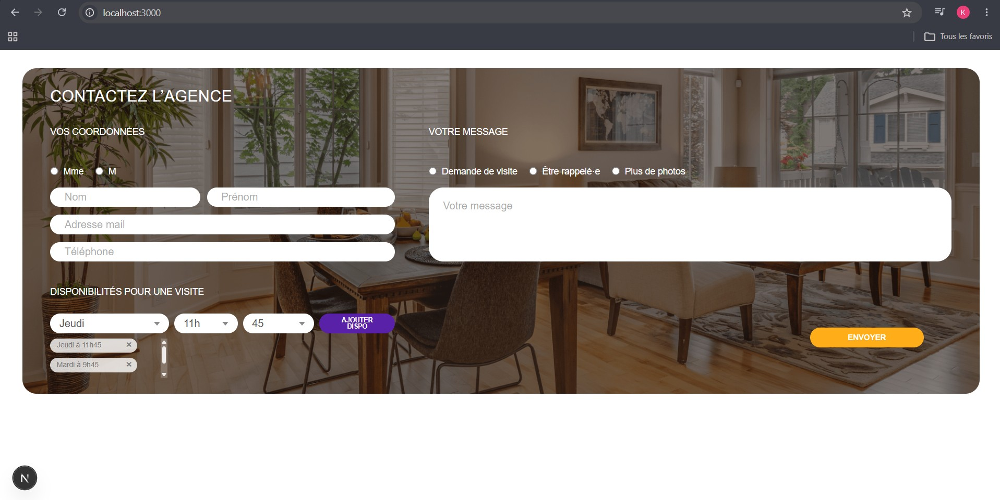
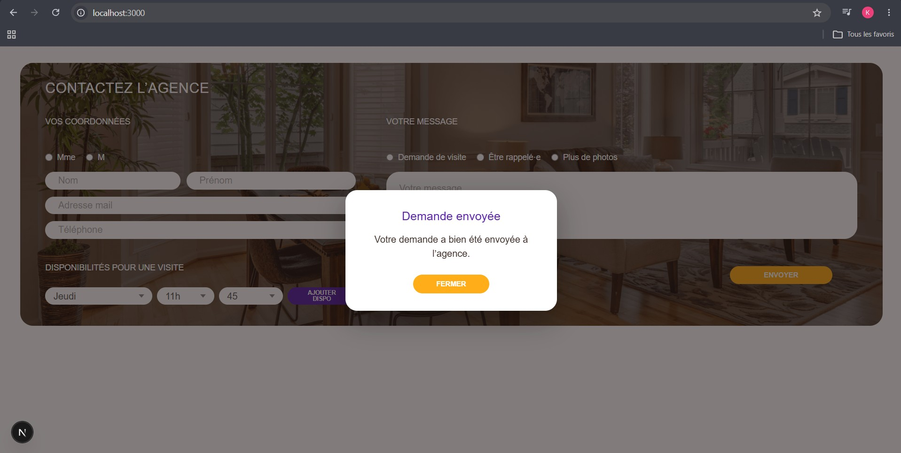

# Test stage développeuse web

## À propos de moi

- **Nom / prénom :** NGUYEN Kim Yen
- **Formation :** Étudiante en troisième année de BUT Métiers du Multimédia et de l’Internet (MMI), spécialité Développement Web et dispositifs interactifs.
- **Stage recherché :** Je cherche un stage pour l’année 2026-2027, selon un rythme de deux semaines en entreprise et deux semaines de cours, d'environ de 14 à 18 semaines et la date de début devrait se situer autour du 14 décembre, mais reste à confirmer.
- **Portfolio :** [nguyen-kimyen.com](https://nguyen-kimyen.com)
- **LinkedIn :** [nguyen-kimyen](https://www.linkedin.com/in/nguyen-kimyen)
- **GitHub :** [kimyngy](https://github.com/kimyngy)

## Aperçu

Intégration d’une page de contact pour une agence immobilière à partir de la maquette fournie. Le formulaire permet de renseigner ses coordonnées, son motif de contact et plusieurs disponibilités pour une visite. Les demandes sont enregistrées dans une base de données locale SQLite.


## Captures d’écran

### Page principale



### Message de confirmation




## Stack technique & choix

- **Framework :** Next.js version 16.2.9  
  J’ai utilisé Next.js car il fournit une structure claire pour créer une application React moderne, avec des routes API intégrées pour enregistrer les données du formulaire.

- **Bibliothèque d’interface :** React version 19.2.4  
  J'ai utilisé React pour construire les composants de l’interface, gérer le formulaire et mettre à jour l’affichage quand l’utilisateur ajoute des disponibilités.

- **Style / UI :** CSS personnalisé  
  J’ai utilisé du CSS personnalisé afin de reproduire la maquette le plus fidèlement possible et de mieux contrôler les espacements, les couleurs, les arrondis et le responsive.
  Tailwind CSS est installé dans le projet par défaut, mais l’interface a été réalisée principalement en CSS personnalisé.

- **Formulaire :** Formulaire React contrôlé avec validation côté interface  
  Les champs obligatoires sont vérifiés avant l’envoi afin d’éviter les données incomplètes. De plus, j'ai fais le choix de rajouter une pop up lorsque l'utilisateur valide ses choix et décide d'envoyer son message.

- **Base de données :** SQLite  
  J'ai choisi d'utiliser SQLite afin de permettre d’enregistrer les données localement simplement, sans avoir besoin d’installer un serveur de base de données séparé.
  Je n'ai pas pu utilisé Docker Desktop car j'ai rencontré des problèmes de lancement sur mon ordinateur. Pour ne pas bloquer l’avancement du projet, j’ai donc choisi SQLite.

- **API :** Route API Next.js  
  Elle sert à recevoir les données du formulaire et à les enregistrer dans la base de données.


## Lancement du projet

### Prérequis

- Node.js 22 ou une version plus récente

### Installation et lancement

Installer les dépendances :

```bash
npm install
```

Lancer le serveur de développement :

```bash
npm run dev
```

Ouvrir ensuite le projet dans le navigateur :

[http://localhost:3000](http://localhost:3000)

La base SQLite locale (`demandes.db`) est créée automatiquement lors du premier envoi du formulaire. Elle n’est pas versionnée dans Git.

Docker n’est pas nécessaire pour lancer ce projet. J’ai choisi SQLite afin de pouvoir enregistrer les données localement sans dépendre d’un serveur externe.


## Questions

### Avez-vous trouvé l’exercice facile ou difficile ? Qu’est-ce qui vous a posé problème ?

J’ai trouvé l’exercice moyennement difficile, notamment parce que React et Next.js ne sont pas encore des outils que je maîtrise totalement. Ce qui m'a posé problème, c'était de reproduire la maquette en utilisant ces outils mais également comprendre comment relier le formulaire à une route API puis stocker les données du formulaire correctement.

### Avez-vous appris de nouveaux outils pour répondre à l’exercice ? Si oui, lesquels ?

Oui, j'ai appris de nouveaux outils pour répondre à l'exercice. Il m’a permis d’approfondir Next.js, les routes API, la gestion d’un formulaire React, ainsi que l’utilisation de SQLite pour enregistrer les données localement.

### Quelle est la place du développement web dans votre cursus de formation ?

Le développement web occupe une place centrale dans ma formation en BUT MMI (Métiers du Multimédia et de l'Internet), en particulier dans mon parcours orienté Développement Web et Dispositifs Interactifs. Nous travaillons à la fois sur l’intégration d’interfaces, le développement front-end et back-end, ainsi que la création de sites web.
Avec l’évolution de l’intelligence artificielle, nous apprenons aussi à utiliser l'IA dans nos travaux, par exemple pour mieux comprendre certaines notions, gagner du temps et améliorer notre manière de travailler, tout en gardant un regard critique sur les réponses proposées.

### Avez-vous utilisé un LLM ? Si oui, comment intégrez-vous les LLM à chaque étape de votre workflow ?

Oui, j'ai utilisé un LLM comme outil d’assistance tout au long du test, notamment pour clarifier certaines notions techniques, me guider étape par étape et vérifier mes choix. Pendant le développement, je l’ai utilisé pour m’aider à comprendre certaines erreurs, structurer et corriger les parties de mes codes, les améliorer et mettre en place l’enregistrement des données.
